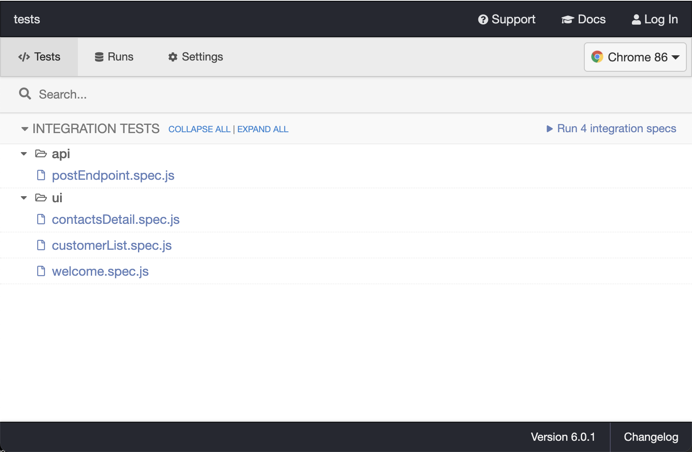
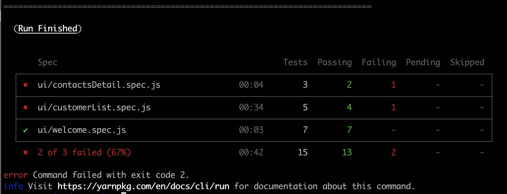
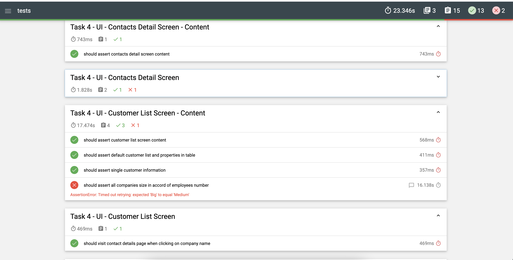
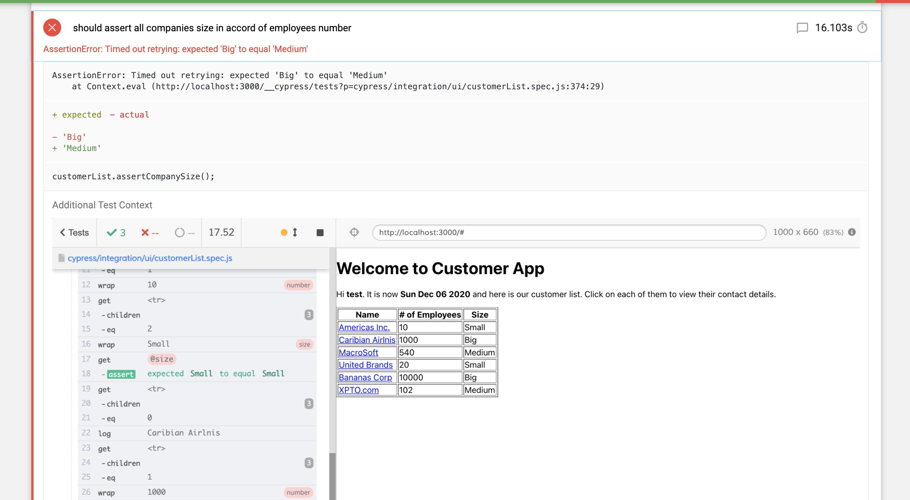
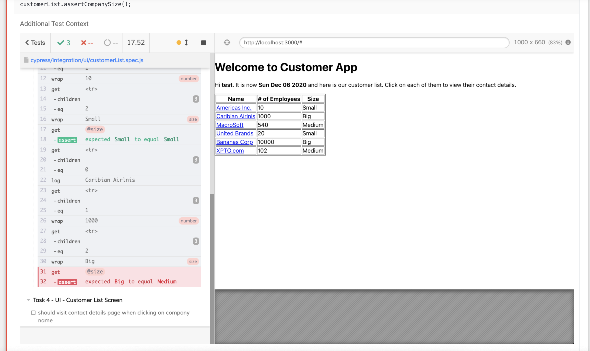

## Task 3: Create an automated API level test scenario ##

Unfortunattely, software application are not perfect neither are the engineers that build them, so as you could see some of the API specs were not followed. To avoid having to manually run all the tests again after each new app version is to be released a good strategy is to create automated tests that could be run quickly and with little effort.

Please complete the following:
1) Build a script/program (using any language/framework/library you want) that runs tests to assert the top 3 API non-compliant scenarios you found;
2) Create a Readme file telling us how to run it; and
3) Commit and push everything to a folder called **api-tests** on the public repository you've created on **Task 1**.

## Task 4: Create an automated UI level test scenario ##

Not just backend engineers make mistakes, and the frontend layer is also responsible for checking business rules and presenting the correct information to the user. Therefore we also need to have ways to automatically check it.

Please complete the following:
1) Build a script/program (using any language/framework/library that you want) that runs tests to assert the top 3 UI non-compliant scenarios you found;
2) Create a Readme file telling us how to run it; and
3) Commit and push those to a folder called **ui-tests** on the public repository you created on **Task 1**.

## Task 3 and 4: Resolution by William Oliveira
### Code Part - Introduction

In this current repo you will be able to test Hopin's challenge using [Cypress](https://www.cypress.io/). If you need to understand a bit more about Cypress, the API documentation is available [here](https://docs.cypress.io/api/api/table-of-contents.html). 

##### Dependencies
As mentioned on [TestEnvironment.md] document. The only pre-requisite to run this app is to have npm and Node.js installed in your machine. For instructions on how to install, go to https://nodejs.org/en/
In addition to that you can also execute the following commands.
> ```bash
> curl -o- https://raw.githubusercontent.com/creationix/nvm/v0.33.1/install.sh | bash
>
> nvm install node
>
> nvm use node
> # Checking the version
> npm -v
> ```

After the completed node's installation, you will need to clone this current repo.

> ```bash
> # Git Links
> Web link to download https://github.com/willcoliveira/test-resolution.git
> or 
>git clone git@github.com:willcoliveira/test-resolution.git
> ```

### Installing the dependencies 
Open a new terminal and navigate to the tests folder and install all dev dependencies using:

> ```bash
> cd /tests
> npm install
> or
> cd /tests
> yarn 
> ```

You will see the following messages: 
> ```bash
> yarn install v1.15.2
> info No lockfile found.
> [1/4] 🔍  Resolving packages...
> [2/4] 🚚  Fetching packages...
> [3/4] 🔗  Linking dependencies...
> [4/4] 🔨  Building fresh packages...
> success Saved lockfile.
> ```

### Make sure that the Backend and Frontend are running before starting the tests

As mentioned on TestEnvironment.md document:
### 1) Starting the backend ###
Open a terminal, go to the root of this repo and:
```
cd backend
npm install
npm start
```
The server will be listening on port 3001. If you need to change this, got to /backend/server.js and change the port variable value in the first line.
```
const port = 3001;
```

### 2) Starting the frontend ###
Open a new terminal, go to the root of this repo and:
**Important:** if you changed the backend port number, you will have to change it also on /frontend/src/App.js, on line 3, before starting the frontend.

```
cd frontend
npm install
npm start
```
Go to to a web browser and open http://localhost:3000/

### How to Run the tests using Cypress Interface
To run the specs with headed GUI and have a way to debug the tests start Cypress using: 

> ```bash
> yarn cy:open
> ```

- 

With the command above, Cypress interface will be open and you can select the browser and the exactly file that you want to run. In addition, you are able to select to run all files directly clicking on "Run All Specs" Button.

If you want to run API tests, select the file inside api folder. Otherwise if you want to run the ui tests, select one of the files from UI folder in accord of the area that you want to test.

Also, you can run all the tests using the cli however with a browser opened to follow the whole execution for ui and api tests
> ```bash
>  yarn test:ui to run all UI tests
>  yarn test:api to run all API tests
> ```
- 
- 

### How to Run the tests with Cypress using CLI in headless mode
The following command will run all the UI specs in headless mode the same that you can add for docker for example.

> ```bash
> # Starting the tests via CLI
> yarn test:ui:headless
> ```

### How to analyse the Cypress Test Results
Current this resolution is also using mochawesome plugin as its report generator. So, once the execution is done using one of the commands below:

> ```bash
> yarn test:ui:headless:mocha for all the UI specs
> or
> yarn test:api:mocha for all the API specs
> ```

- 

So, you can run the tests using those commands in order to access a usefull and detailed report.
You can click on the link previous created as it is possible to see on the image above

> ```bash
>$PATH/tests/cypress/results/output.html
> ```
 
### Final Report
-  

### Final Report with Failures
Also, If the test fails it will show the exactly step and a screenshot of that moment.

- 
- 

================================================

